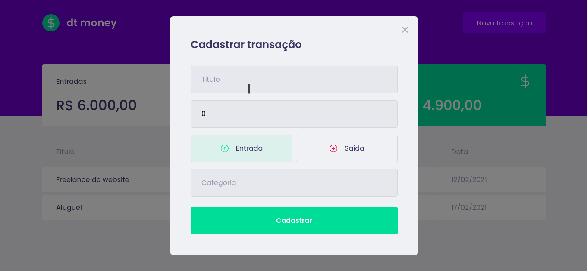

<h1 align="center">
   
</h1>
<h1 align="center" widht="50%">
  
  
  
</h1>

## ⚡️ The Project
DtMoney is a ReactJS application that can you to control your finances. You can add incomes and withdraws to control you month's expenses. 
  
## 🎯 Features
 - Fake API with MirageJS
 - Modal with react-modal lib
  
## 🖥️ Used Tecnologies
 - [ReactJ](https://reactjs.org/)
 - [MirageJS](https://miragejs.com/)
 - [Axios](https://axios-http.com/docs/intro)
 - [Styled-Components](https://styled-components.com/)

## ⚙️ Dependencies
 - [Yarn](https://yarnpkg.com/)
 
## 🚀️ Getting Started

1. Clone this repository: 

```bash
git clone https://github.com/avnerjose/reactjs-dtmoney.git && cd reactjs-dtmoney
```
2. Install all dependencies

```bash
yarn
```
3. Start the app
```bash
yarn dev
```
4. Open [localhost:3000](http://localhost:3000) to see the app working
